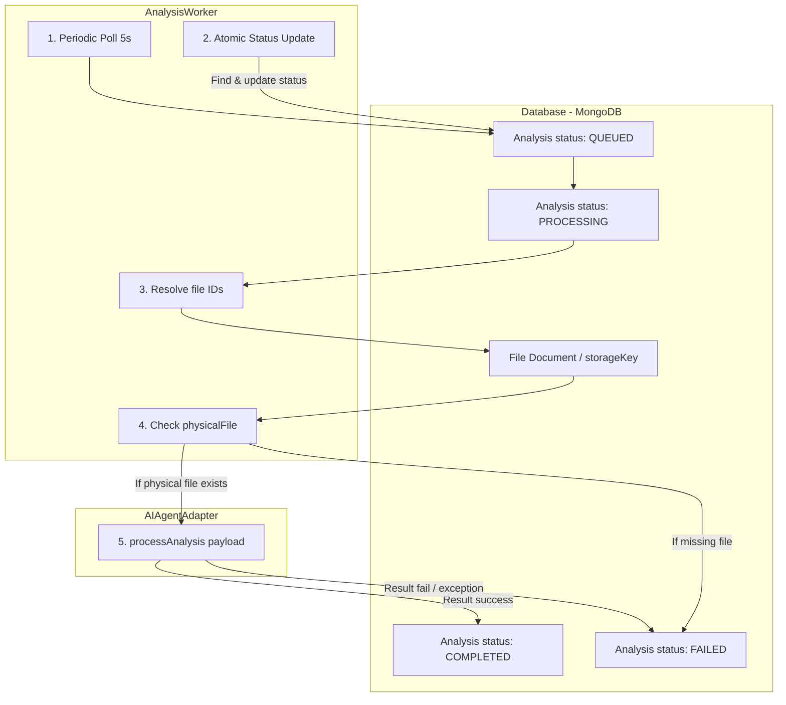

# AI Worker & Bridge Layer Documentation

This document describes the background worker and AI adapter bridge implemented for orchestrating AI analysis tasks in the PS117 backend.

---

## 1. Overview & Architecture

The worker acts as a database-backed job runner that polls the database for analyses needing execution, validates access to their target documents, prepares the context payload, and executes the AI agent workflow.



---

## 2. Queue & Worker Behavior

* **Worker Entry Point:** `backend/src/services/ai/analysisWorker.js`
* **Initialization:** Initialized and started automatically in `backend/src/server.js` once the MongoDB connection is established.
* **Polling Loop:** Runs a timer-based loop every 5 seconds.
* **Atomic Job Fetching:** To prevent concurrent instances from processing the same analysis, the worker uses Mongoose's atomic `findOneAndUpdate` to find one `QUEUED` analysis and transition it to `PROCESSING` in a single query:
  ```javascript
  const analysis = await Analysis.findOneAndUpdate(
    { status: "QUEUED" },
    { $set: { status: "PROCESSING", startedAt: new Date() } },
    { new: true }
  );
  ```
  This guarantees that once a worker picks up a job, no other worker instance can process it.

---

## 3. File Resolution & Storage Key

For every file listed in the `analysis.inputFiles` array:
1. **ID Validation:** The worker confirms that the file ID is a valid MongoDB ObjectId.
2. **Metadata Fetch:** The worker retrieves the File document from MongoDB.
3. **Status Check:** Confirms the file status is not `DELETED`.
4. **Key Verification:** Verifies the file has a valid `storageKey`.
5. **Physical Path Resolution:** Resolves the path to the file using:
   ```javascript
   const physicalPath = path.resolve(process.cwd(), file.storageKey);
   ```
6. **Availability Check:** Verifies if the file exists on disk at `physicalPath`. If the file does not exist, it throws a `physical file unavailable` error.

---

## 4. AI Adapter Interface & Payload

* **Module location:** `backend/src/services/ai/aiAdapter.js`
* **Method:** `AIAgentAdapter.processAnalysis(payload)`
* **Payload Format (JSON):**
  ```json
  {
    "analysisId": "6a9050435ca4afbf481df486",
    "type": "DOCUMENT",
    "instruction": "Analyze the document for personal identifiable information (PII) leakage.",
    "inputFiles": [
      {
        "fileId": "6a9050435ca4afbf481df485",
        "filename": "sovereignty_guidelines.pdf",
        "originalName": "sovereignty_guidelines.pdf",
        "mimeType": "application/pdf",
        "size": 2048500,
        "storageKey": "uploads/project_alpha/sovereignty_guidelines.pdf",
        "status": "READY",
        "classification": "CONFIDENTIAL",
        "physicalPath": "/absolute/path/to/project/uploads/project_alpha/sovereignty_guidelines.pdf"
      }
    ]
  }
  ```

---

## 5. Success (COMPLETED) and Failure (FAILED) Flows

Both flows reuse the existing database update mechanisms in `analysisService` to avoid duplicating transition logic.

### COMPLETED Flow
If the AI Adapter resolves successfully:
1. Call `analysisService.updateAnalysisStatus(analysisId, "COMPLETED", { result, agentPlan })`.
2. Updates `completedAt` to the current time, sets `result` and `agentPlan` values in MongoDB.

### FAILED Flow
If any step fails (e.g. invalid file, missing file, AI exception, physical file unavailable):
1. Catch the error.
2. Call `analysisService.updateAnalysisStatus(analysisId, "FAILED", { error: err.message })`.
3. Updates `completedAt` to the current time and stores the error message string.

---

## 6. Current Storage Limitation & AI Teammate Handoff

### Current Limitation
* The backend does not yet support binary multipart uploads. Files are registered via metadata only.
* Because the physical files are not actually written to disk, **any analysis will fail with a `physical file unavailable` error by default.**

### RAG / AI Teammate Instructions (Next Steps)
To build out the RAG/AI inference pipeline:
1. **Implement Physical File Uploads:** Update the file upload routes (e.g., using `multer` or a cloud client) to write the actual bytes to the location corresponding to the `storageKey`.
2. **Replace the Stub Adapter:** Implement the model inference logic in `backend/src/services/ai/aiAdapter.js`.
   * Read the physical bytes at the resolved `physicalPath`.
   * Run your document parser, embedding generator, vector DB index search, or prompt execution using Ollama/Gemma.
   * Return the result matching the required schema:
     ```json
     {
       "success": true,
       "result": {
         "piiDetected": true,
         "complianceScore": 75,
         "details": "PII leaked in section 3.2..."
       },
       "agentPlan": {
         "stepsRun": ["ocr_scan", "regex_pii_check"]
       }
     }
     ```

---

## 7. How to Test Locally

1. **Verify Automatic Boot:**
   Start the backend server (`npm run dev`). You should see:
   `[AnalysisWorker] Starting analysis polling worker...`
   in the console.

2. **Trigger Failure (File Unavailable):**
   * Log into the React dashboard (`http://localhost:5174/`).
   * Go to **Tasks**, and click **New Task** in the top right.
   * Provide instructions (e.g. "Analyze compliance") and confirm.
   * The backend will create a `QUEUED` analysis.
   * The console logs will immediately show:
     ```text
     [AnalysisWorker] Picked up Analysis <id> for processing.
     [AnalysisWorker] Failed to process Analysis <id>: physical file unavailable
     ```
   * Go to the **Tasks** page, select the **Failed** tab. You will see the task listed, and the sidebar will show the error details: `physical file unavailable`.

3. **Trigger Success (Completed Stub):**
   * To satisfy the physical availability check, create the missing folder and dummy file at the project root matching the storage key of the seeded file:
     * Directory: `backend/uploads/project_alpha/`
     * File: `sovereignty_guidelines.pdf` (can be empty text or dummy PDF)
   * On the dashboard, go to the **Failed** tab, select the failed task, and click **Retry Task** in the bottom right.
   * A new `QUEUED` analysis will be registered.
   * The worker will pick it up, find the file exists, successfully call the `aiAdapter`, and transition it to `COMPLETED`.
   * You can see the completed task with its results in the **Completed** tab.
