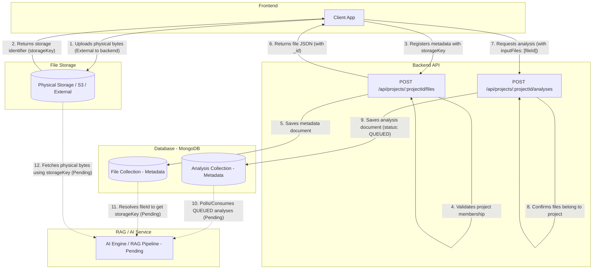

# File Flow & AI/RAG Integration Architecture

This document outlines the technical design, endpoints, and flow for files and AI/RAG services based on the current implementation of the backend.

---

## 1. Complete File Flow

The current backend implementation manages file metadata only. The actual upload of physical files to a storage provider is not implemented in the backend code and must be handled externally or client-side. 

Below is the diagram of the actual flow supported by the codebase:



---

## 2. File Upload

The backend does not accept raw multipart/form-data or binary files. Instead, it exposes a metadata registration endpoint.

* **Endpoint:** `POST /api/projects/:projectId/files`
* **HTTP Method:** `POST`
* **Content-Type:** `application/json`
* **Request Body Payload (JSON):**
  ```json
  {
    "filename": "string (required, max 500 chars)",
    "originalName": "string (required, max 500 chars)",
    "mimeType": "string (required, e.g., 'application/pdf')",
    "size": "number (required, integer, min 0, max 100MB)",
    "storageKey": "string (required, max 1000 chars, e.g., 'uploads/project_alpha/doc.pdf')",
    "classification": "string (optional, PUBLIC | INTERNAL | CONFIDENTIAL | HIGHLY_CONFIDENTIAL, defaults to 'INTERNAL')"
  }
  ```
* **Middleware Stack:**
  1. `authenticate`: Verifies the user's JWT token (extracted from the `Authorization: Bearer <token>` header or `token` cookie) and populates `req.user`.
  2. `requireProjectAccess()`: Enforces that the authenticated user is a member of the project defined by `:projectId` in the route.
  3. `validate(fileMetadataSchema)`: Joi middleware validating the structure of the JSON payload.

---

## 3. Where the File is Saved

* **Physical File Storage:** Physical file storage is not currently implemented. The backend does not store files locally (the `backend/uploads/` directory exists but remains empty and is not referenced in upload routes) nor does it write files directly to cloud storage.
* **Storage Path/Logic:** The physical file's location is represented solely by the `storageKey` string provided by the client when registering the file. The backend saves this string exactly as-is into MongoDB without path validation or generation.

---

## 4. What is Stored in MongoDB

MongoDB stores only the **FILE RECORD/METADATA**, not the actual file bytes.

### File Schema (`src/models/File.js`)

| Field | Type | Description |
| :--- | :--- | :--- |
| `_id` | `ObjectId` | Auto-generated unique file record identifier. |
| `projectId` | `ObjectId` | Reference to the `Project` model (indexed). |
| `uploadedBy` | `ObjectId` | Reference to the `User` model (indexed). |
| `filename` | `String` | System-assigned filename string. |
| `originalName` | `String` | Original name of the uploaded file. |
| `mimeType` | `String` | MIME type (e.g. `application/pdf`). |
| `size` | `Number` | File size in bytes. |
| `storageKey` | `String` | External/physical storage identifier/path. |
| `status` | `String` | Status enum: `UPLOADED`, `PROCESSING`, `READY`, `FAILED`, `DELETED` (default: `UPLOADED`, indexed). |
| `classification` | `String` | Security classification enum: `PUBLIC`, `INTERNAL`, `CONFIDENTIAL`, `HIGHLY_CONFIDENTIAL` (default: `INTERNAL`, indexed). |
| `createdAt` | `Date` | Autogenerated upload timestamp. |
| `updatedAt` | `Date` | Autogenerated last modified timestamp. |

---

## 5. File ID and Path

```
File ID (_id) ──> MongoDB File Document ──> storageKey ──> Physical Storage
```

* **Frontend:** Receives the fully created metadata document (including the auto-generated `_id` and the `storageKey`). When launching operations like AI analysis, the frontend references files using their MongoDB `_id` (File ID).
* **RAG / AI Service:** Needs the `storageKey` to locate and retrieve the file from physical storage, as well as metadata such as `mimeType` and `classification` for correct processing and security filtering.

---

## 6. Backend → RAG / AI

* **Current Status:** The database-polling `AnalysisWorker` and `AIAgentAdapter` bridge interface are fully implemented and running.
* **Communication:** The `AnalysisWorker` fetches `QUEUED` analyses from MongoDB, validates all target files, checks physical file availability at the path resolved from the `storageKey`, prepares a clean payload containing the files' metadata and paths, and invokes `AIAgentAdapter.processAnalysis(payload)`.
* **Analysis Job Creation:** Creating an analysis via `POST /api/projects/:projectId/analyses` sets the status to `"QUEUED"`. The worker automatically picks it up within 5 seconds.
* **Status Updates:** The worker uses the existing status-update services to transition the analysis status to `"COMPLETED"` (on success) or `"FAILED"` (on error, storing a descriptive error string).

---

## 7. Authorization

File and resource access are strictly authorized in the backend layer:

```
Frontend ──> JWT Authentication (Bearer/Cookie) ──> Project Membership Check ──> File Ownership Check
```

1. **Authentication:** All requests must include a valid JWT token.
2. **Project Membership Check (`requireProjectAccess`):** Routes under `/api/projects/:projectId` verify that the authenticated user's ID matches an active `ProjectMember` record linked to that `projectId`.
3. **File Ownership Check:** In `fileController.getFileById`, the backend double-checks that the target file's `projectId` matches the `:projectId` parameter provided in the request before returning any metadata.
4. **AI Interface Security:** The RAG/AI service must verify permissions through backend-authenticated contexts instead of trusting client-supplied file IDs or paths.

---

## 8. RAG Developer Handoff

### Information RAG Developer Needs

* **File Query Endpoints:**
  * `GET /api/projects/:projectId/files` - List metadata for project files.
  * `GET /api/projects/:projectId/files/:fileId` - Retrieve details of a single file.
* **File ID:** Represented by the `_id` field in MongoDB.
* **Storage Location:** External to the backend. Physical files must be retrieved using the `storageKey`.
* **Path/URL Field:** `storageKey` contains the target file's path/key in the physical storage system.
* **MIME Type:** Read the `mimeType` field to handle file parsing (e.g. PDF, text, images).
* **Authentication Requirement:** Backend endpoints require a valid JWT passed in the `Authorization` header as `Bearer <token>`.
* **Project Authorization Requirement:** Access is restricted to users listed as members of the specific project.
* **Current AI Integration Status:** **AI/RAG integration is not yet implemented.** A job worker or consumer needs to be built to poll or receive `"QUEUED"` analyses, resolve their `inputFiles` to retrieve their physical files via `storageKey`, and update results using `PATCH /api/analyses/:analysisId/status`.

---

## 9. Frontend Handoff

### Information Frontend Developer Needs

* **Registration Endpoint:** `POST /api/projects/:projectId/files`
* **Request Format:** JSON (Content-Type: `application/json`) containing:
  `filename`, `originalName`, `mimeType`, `size`, `storageKey`, and `classification`.
* **Response Details:** Returns `{ success: true, data: FileObject }` where `FileObject` contains the generated database ID `_id`.
* **File ID:** Track `data._id` for all downstream operations.
* **File Reference in Analysis:** When launching an analysis request via `POST /api/projects/:projectId/analyses`, provide the file IDs in the `inputFiles` array:
  ```json
  {
    "type": "DOCUMENT",
    "instruction": "Summarize this document.",
    "inputFiles": ["65f...1a2"]
  }
  ```

---

## 10. Current Status

### Implemented
* JWT authentication and project-membership-based endpoint access control.
* Mongoose schema for file metadata (`File.js`) and database index optimizations.
* Metadata registration, listing, and single-file retrieval endpoints.
* File status (`PATCH`) and metadata deletion (`DELETE`) endpoints (Admin only).
* Analysis job metadata registration (`Analysis.js`), which accepts and validates project-specific input file IDs.
* Background database-polling analysis worker (`AnalysisWorker`) and AI adapter bridge (`AIAgentAdapter`).

### Pending
* Physical file upload handling (no local uploads handler or direct cloud storage pipeline exists).
* File serving endpoint (retrieving the actual file content/stream).
* RAG processing logic, embeddings generation, vector storage, and inference pipelines.
